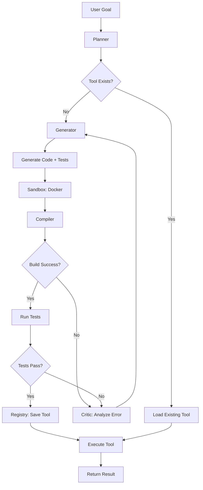

# Ouroboros 🐍

**A compiler-verified LLM code-synthesis agent that builds, tests, and evolves executable Go tools autonomously.**

[](https://github.com/arthurlw/ouroboros/actions)
[](https://goreportcard.com/report/github.com/arthurlw/ouroboros)
[](https://opensource.org/licenses/MIT)
[](https://go.dev/)

---

## What is Ouroboros?

Unlike standard LLM coding assistants that generate static text, **Ouroboros** is a rigorous build system that:

1. 📋 **Plans** - Breaks your goal into atomic implementation steps
2. 🔨 **Generates** - Writes Go source code + comprehensive tests
3. ✅ **Verifies** - Compiles and tests in isolated Docker containers
4. 🔄 **Evolves** - Refines code through feedback loops until tests pass
5. 💾 **Persists** - Saves verified tools for reuse (no context loss!)

**Key Differentiator**: Ouroboros enforces *compiler and test verification* on every generated tool before accepting it. No more hallucinated code that doesn't compile.

---

## Quick Start

### Installation

```bash
# Clone the repository
git clone https://github.com/arthurlw/ouroboros.git
cd ouroboros

# Build the Docker executor image
docker build -f Dockerfile.executor -t ouroboros-executor:latest .

# Build Ouroboros
make build

# Or install directly
make install
```

### Set Up Your LLM Provider

Ouroboros supports multiple providers (choose one):

```bash
# Anthropic Claude (recommended)
export ANTHROPIC_API_KEY="your-key-here"

# OR Groq (fast, generous free tier)
export GROQ_API_KEY="your-key-here"

# OR OpenAI
export OPENAI_API_KEY="your-key-here"

# OR Ollama (local, no API key needed)
# Just run: ollama serve
```

### Run Your First Goal

```bash
./bin/ouroboros -goal "calculate the 100th fibonacci number"
```

Ouroboros will:
1. Plan the implementation
2. Generate Go code with memoization
3. Write comprehensive tests
4. Verify in Docker sandbox
5. Execute and return the result

---

## Architecture



### Core Components

| Component | Purpose | File |
|-----------|---------|------|
| **Planner** | Decomposes goals into atomic steps | `internal/agent/planner.go` |
| **Generator** | Produces Go code + unit tests | `internal/agent/generator.go` |
| **Critic** | Analyzes build/test failures | `internal/agent/critic.go` |
| **Sandbox** | Executes code in isolated Docker containers | `internal/sandbox/docker.go` |
| **Registry** | Manages persistent tool library | `internal/skills/mcp.go` |
| **LLM Providers** | Anthropic, Groq, OpenAI, Ollama | `internal/llm/*.go` |

---

## How It Works: The Evolution Loop

Ouroboros uses a **convergence loop** with a maximum retry budget (default: 6 attempts):

1. **Generate** → LLM creates `main.go` + `main_test.go`
2. **Sanitize** → AST-based deduplication removes collisions
3. **Build** → `goimports` + `go test` in Docker
4. **Verify** → Critic classifies failures (Build/Test/Timeout)
5. **Refine** → Targeted fixes:
   - Build failures → Fix implementation OR tests
   - Test failures → Alternate between code and test fixes
   - Timeouts → Simplify implementation
6. **Repeat** → Until tests pass or budget exhausted

If successful, the tool is registered to `skills_library/verified/<tool>/` for future reuse.

---

## Features

### ✅ Compiler-Verified Code Generation
- No hallucinated code ships to production
- AST-based sanitization prevents duplicate functions
- Automatic import management with `goimports`

### 🔄 Smart Retry with Exponential Backoff
- Handles rate limits (429) and server errors (5xx)
- Backoff: 1s → 2s → 4s → 8s (configurable)

### 🛡️ Regression Guard
- Existing tools are never overwritten accidentally
- Enforces `ExistingTool=true` when tool already exists

### 📦 Persistent Tool Library
- Verified tools saved to `skills_library/verified/`
- MCP-compatible schema for future IDE integration
- Version-aware storage (roadmap)

### 🐳 Sandboxed Execution
- Isolated Docker containers (no network, limited resources)
- Timeout protection (45s for tests, 30s for execution)
- Automatic cleanup

### 🎯 Multiple LLM Providers
- **Anthropic**: Claude Sonnet 4 (best quality)
- **Groq**: Llama 3.3 70B (fastest)
- **OpenAI**: GPT-4o (proven reliability)
- **Ollama**: Qwen 2.5 Coder 7B (local, private)

### 🔍 Typed Failure Taxonomy
- `FailureBuild` → Compiler errors
- `FailureTest` → Test failures
- `FailureTimeout` → Execution timeouts
- `FailureUnknown` → Other errors

---

## Configuration

### Environment Variables

| Variable | Description | Default |
|----------|-------------|---------|
| `ANTHROPIC_API_KEY` | Anthropic Claude API key | - |
| `GROQ_API_KEY` | Groq API key | - |
| `OPENAI_API_KEY` | OpenAI API key | - |
| `OLLAMA_HOST` | Ollama server address | `http://localhost:11434` |

### Command-Line Flags

```bash
ouroboros [flags]

Flags:
  -goal string
        The objective for Ouroboros to accomplish (required)
```

### Future Flags (Roadmap)

```bash
  -max-tokens int
        Maximum tokens budget for LLM calls
  -max-cost-usd float
        Maximum cost budget in USD
  -verbose
        Enable verbose logging with token counts
  -record string
        Record LLM interactions to directory
  -replay string
        Replay from recorded directory (deterministic)
```

---

## Example Usage

### Basic Computation

```bash
$ ./bin/ouroboros -goal "compute the SHA-256 hash of 'hello world'"

🧠 Using Provider: GROQ (Llama 3.3 70B)
🔵 PLAN GENERATED (steps: 1)
✨ CREATING NEW TOOL (tool: sha256_hasher)
🔄 ITERATION 1/6
🟢 TOOL VERIFIED (name: sha256_hasher)
🏁 FINAL EXECUTION

💬 OUROBOROS SAYS:
The SHA-256 hash of 'hello world' is:
b94d27b9934d3e08a52e52d7da7dabfac484efe37a5380ee9088f7ace2efcde9
```

### File Processing

```bash
$ ./bin/ouroboros -goal "count the number of Go files in the current directory"

# Ouroboros will create a file scanner tool and execute it
```

### Using Existing Tools

```bash
$ ./bin/ouroboros -goal "scan ports 80 and 443 on localhost"

🛡️ REGRESSION GUARD: Tool exists. Enforcing ExistingTool=true
🛠️ USING TOOL (tool: port_scanner)
🔍 RAW TOOL OUTPUT

💬 OUROBOROS SAYS:
Port 80: closed
Port 443: closed
```

---

## Development

### Running Tests

```bash
# All tests
make test

# With race detector
make test-race

# Coverage report
make coverage
```

### Code Quality

```bash
# Format code
make fmt

# Run linters (go vet + staticcheck)
make lint

# Full pre-release check
make release-check
```

### Building Release Binaries

```bash
make release

# Outputs:
# bin/release/ouroboros-linux-amd64
# bin/release/ouroboros-linux-arm64
# bin/release/ouroboros-darwin-amd64
# bin/release/ouroboros-darwin-arm64 (Apple Silicon)
# bin/release/ouroboros-windows-amd64.exe
```

---

## Roadmap

### Phase 1: Architecture Cleanup *(In Progress)*
- [x] Refactor LLM providers into `internal/llm/`
- [x] Add retry with exponential backoff
- [x] Enforce regression guard
- [x] Validate tool names
- [ ] Add observability (trace IDs, token tracking, cost tracking)
- [ ] Budget guards (`--max-tokens`, `--max-cost-usd`)
- [ ] Record/replay mode for debugging
- [ ] Versioned tool storage (`v1`, `v2`, etc.)

### Phase 2: SWE-Bench Ready
- [ ] Repo-ingest mode with AST symbol indexing
- [ ] BM25 search for relevant files
- [ ] Patch generation mode (unified diff)
- [ ] Multi-language support (Python, Node.js sandboxes)
- [ ] SWE-Bench Lite evaluation harness

### Phase 3: Production Hardening *(Completed)*
- [x] MIT License
- [x] GitHub Actions CI (Go 1.24/1.25, Linux/macOS)
- [x] CodeQL security scanning
- [x] Comprehensive Makefile
- [x] CONTRIBUTING.md
- [x] Issue/PR templates

### Future Vision
- MCP Server for Claude Desktop/Cursor integration
- WebAssembly sandbox for browser execution
- Multi-agent collaboration (parallel tool development)
- Self-improvement mode (Ouroboros optimizing its own codebase)

---

## FAQ

**Q: How is this different from Cursor/Copilot/Aider?**
A: Those are assistants. Ouroboros is an autonomous *build system* with compiler verification. It won't accept code that doesn't compile and pass tests.

**Q: Does it work offline?**
A: Yes! Use Ollama as your provider (runs locally, no internet required).

**Q: How much does it cost?**
A: Depends on your provider:
- **Groq**: Generous free tier (~100 requests/day)
- **Ollama**: Free (local)
- **Anthropic/OpenAI**: Pay-per-token (~$0.01-0.10 per goal)

**Q: Can I use it for production code?**
A: The verification loop makes it safer than raw LLM output, but always review generated code. Best for prototyping, scripts, and utilities.

**Q: Why Go only?**
A: Go's fast compilation and strong typing make it ideal for verified code generation. Python/Node support is on the roadmap.

---

## Contributing

We welcome contributions! Please see [CONTRIBUTING.md](CONTRIBUTING.md) for:
- Development setup
- Coding standards
- How to add new LLM providers
- Pull request process

---

## License

This project is licensed under the MIT License - see the [LICENSE](LICENSE) file for details.

---

## Acknowledgments

- Inspired by the SWE-Bench evaluation framework
- Built on the shoulders of giants: Go, Docker, and modern LLMs
- Special thanks to the open-source community

---

## Support

- **Issues**: [GitHub Issues](https://github.com/arthurlw/ouroboros/issues)
- **Discussions**: [GitHub Discussions](https://github.com/arthurlw/ouroboros/discussions)

---

<p align="center">
  <strong>Built with ❤️ and 🤖</strong>
</p>
